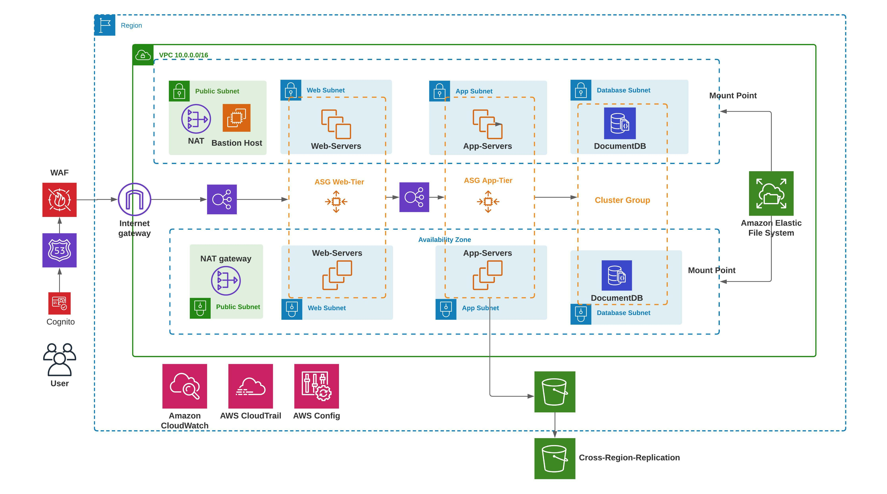

# Instructions

# Overview - what we build 
- Exception: WAF code is currently not provided




<style>
r { color: Red }
</style>

# <r>**Before you begin**</r>

**In root/providers.tf**
- set profile name to yours
- set desired region

**Create root/terraform.tfvars file**
- (has to be created newly because sensitive data is stored and shouldn't be uploaded to Github)

- add: <br/>
```
access_ip = "your_ip_address/32" or "0.0.0.0/0" 

dbname     = "name" 
dbuser     = "username" 
dbpassword = "password" 

docdb_master_username = "foo" 
docdb_master_password = "mustbeeightchars" 
```
**create SSH keys**<br/>
- we need 3 keys:
```
 ./keys/webserver.pem
 ./keys/bastionhost.pem
 ./keys/backendserver.pem
 ```
- cretae key dir and add 3 keys: <br/>
```
mkdir keys

ssh-keygen -t rsa 
-> prompt: ./keys/***.pem
-> prompt: enter 
-> prompt: enter 
```


# To do - when implementing application
- no application running, currently dummy html page only

Load balancer:
- Backend LB is not yet connected to webserver LB (set up/configure Listener)


Route 53:
- if you have a domain name, update the name servers with the once from the hosted zone (type:NS)  <br/>

SSL: 
- After the SSL-Cert of AWS (ACM) is created (around 30min) you can add it in the console to the Webserver-LB to enable https


# Working with TF
- terraform init 
- terrafrom validate 
- terraform plan 
- terraform apply --auto-approve
- terraform destroy --auto-approve


